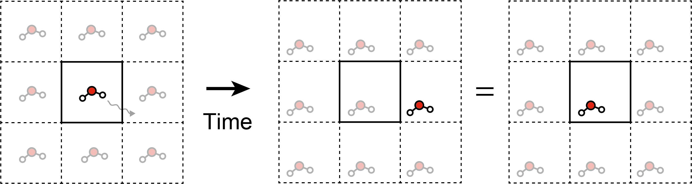

# Molecular Dynamics
## Background
* In this lecture, we will see molecular dynamics (MD) and how to do it with Gaussian.

## Hellmann-Feynman theorem
```math
\frac{\partial}{\partial\lambda}\braket{\Psi|\hat{H}|\Psi}
=\braket{\Psi|\frac{\partial\hat{H}}{\partial\lambda}|\Psi}
```

* For wave functions that are not completely optimized for all parameters (in most cases!), the Hellmann-Feymann theorem does not hold, so the left-hand-side and right-hand-side of the above equation are not identical.
* The difference between these two values is generally not negligible, but becomes smaller by improving the accuracy; it increases computational cost, of course.

* For calculating the gradient of the energy with respect to the atomic positions (${\bf R}$), the above theorem becomes
```math
\begin{align*}
\frac{\partial E}{\partial {\bf R}}
= \frac{\partial}{\partial{\bf R}}\braket{\Psi|\hat{H}|\Psi}
&= \braket{\frac{\partial\Psi}{\partial{\bf R}}|\hat{H}|\Psi} + \braket{\Psi| \frac{\partial\hat{H}}{\partial{\bf R}} |\Psi} + \braket{\Psi| \hat{H}|\frac{\partial\Psi}{\partial{\bf R}}} \\
&= E\braket{\frac{\partial\Psi}{\partial{\bf R}}|\Psi} + E\braket{\Psi|\frac{\partial\Psi}{\partial{\bf R}}} + \braket{\Psi| \frac{\partial\hat{H}}{\partial{\bf R}} |\Psi}
\end{align*}
```

* The first two terms are different from the Hellmann-Feymann force, and it is called *Pulay force*.
* The correction to the Pulay force is necessary when the wave function is dependent on the nuclear position (${\bf R}$).
* The Gauss functions used in the Gaussian are nuclear-position-dependent, because we put these functions on the atomic positions.
* However, the plane-wave basis set is not dependent on the nuclear position. So one can calculate the energy gradient without the Pulay force.
* This *reduces the computational cost _of gradient calculation and increases_ the accuracy of the energy gradient*. Since the MD calculation heavily relies on the energy, and (more) on the force, this difference in accuracy is of practical importance.

## Periodic boundary condition
* Another reason why Gaussian is not often used in the MD calculation is that it has poor capability to treat the **periodic boundary condition (PBC)*.
* PBC assumes the translational symmetry of the unit cell holds for x, y, and z-directions.
* PBC enables us to "cut" the part of a real material. This is a good approximation when the material's structure is homogeneous.
* Since atoms or molecules usually drift everywhere during the MD simulation, they often go out of the unit cell boundary.
* When the PBC is assumed, they also can be treated within the unit cell. Without the PBC, they are drifting away and away by time.

<p align=center>


Fig. MD simulation under the PBC. The molecule drifting away from the unit cell (solid box) can be represented as the molecule "entering" from the neighboring unit cell.
</p>

## Computation
* Running AIMD with Gaussian is not impossible but its function is limited. This is available with `BOMD` keyword; see https://gaussian.com/bomd/.
* Here we will use *Atomic simulation environment (ASE)* and call Gaussian from it.
* A simple Python script to do MD with ASE is as follows (using EMT potential instead)
```python
from ase.build import molecule
from ase.md.verlet import VelocityVerlet
from ase.calculators.emt import EMT
from ase import units

mol = molecule("H2O")
mol.calc = EMT()
dyn = VelocityVerlet(mol, timestep=1.0*units.fs, trajectory="result.traj")
dyn.run(100)
```
